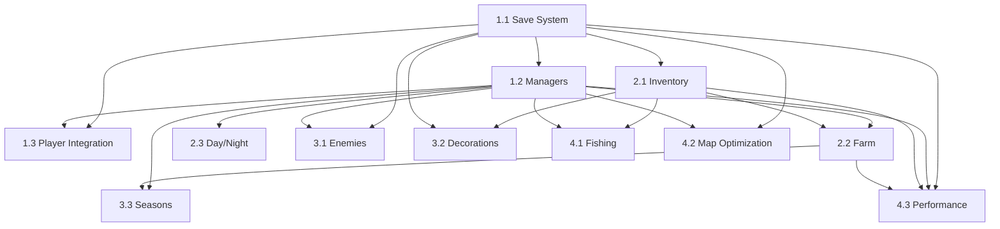

# 🎯 Plano de Ação MVP - Darkness Dungeon

> **Objetivo:** Entregar um MVP jogável com sistemas de save/load, inventário, farm, ciclo dia/noite e combate básico.
>
> **Arquitetura Base:** MVC + Singleton Managers + JSON Persistence
>
> **Prazo Estimado:** 5 semanas

---

## 📋 Índice de Fases

1. [**FASE 1: FUNDAÇÃO**](#fase-1-fundação-semana-1) - Sistema de Save/Load + Managers Base
2. [**FASE 2: GAMEPLAY**](#fase-2-gameplay-semana-2-3) - Inventário + Farm + Ciclo Dia/Noite
3. [**FASE 3: CONTEÚDO**](#fase-3-conteúdo-semana-4) - Inimigos + Decorações + Estações
4. [**FASE 4: POLISH**](#fase-4-polish-semana-5) - Otimizações + Pesca (opcional)

---

## FASE 1: FUNDAÇÃO (Semana 1)

### 1.1 Sistema de Save/Load Base 🔴 CRÍTICO

**Dependências:** Nenhuma (fundação de tudo)

**Arquivos a criar:**

```
lib/gameplay/core/modules/save/
├── save_manager.dart
├── save_data_model.dart
├── save_repository.dart
├── save_repository_native.dart
└── save_repository_web.dart
```

**Checklist de Entrega:**

- [ ] SaveRepository abstrato com factory multiplataforma
- [ ] SaveManager singleton funcional
- [ ] SaveData model com serialização JSON
- [ ] Versionamento de save implementado
- [ ] Testes unitários de persistência (save/load/delete)
- [ ] Tratamento de erro para save corrompido

**Link para guia detalhado:** [→ FASE_1_1_SAVE_LOAD_SYSTEM.md](./FASE_1_1_SAVE_LOAD_SYSTEM.md)

---

### 1.2 Managers de Estado Global 🔴 CRÍTICO

**Dependências:** Sistema de Save/Load (1.1)

**Arquivos a criar:**

```
lib/gameplay/core/modules/world/
├── world_state_manager.dart
├── map_state_model.dart
└── season.dart (enum)

lib/gameplay/core/modules/time/
├── time_manager.dart
├── time_of_day.dart (enum)
└── time_config.dart

lib/gameplay/core/modules/player/
└── player_progress_manager.dart
```

**Checklist de Entrega:**

- [ ] WorldStateManager (dia atual, estação, mapas ativos)
- [ ] TimeManager (ciclo temporal, callbacks)
- [ ] PlayerProgressManager (flags, conquistas)
- [ ] Integração com SaveManager
- [ ] Testes de serialização de cada manager

**Prompts necessários:** [Ver seção detalhada](#prompts-fase-12)

---

### 1.3 Integração Save ↔ Player 🟡 IMPORTANTE

**Dependências:** Sistema de Save/Load (1.1) + Managers (1.2)

**Arquivos a modificar:**

```
lib/gameplay/characters/knight_player/knight_player_model.dart
lib/gameplay/characters/sunny_player/sunny_player_model.dart
```

**Checklist de Entrega:**

- [ ] Métodos toJson() em PlayerModel
- [ ] Métodos fromJson() em PlayerModel
- [ ] Salvar posição, health, stats
- [ ] Restaurar player ao carregar save
- [ ] Teste de save/load completo do player

**Prompts necessários:** [Ver seção detalhada](#prompts-fase-13)

---

## FASE 2: GAMEPLAY (Semana 2-3)

### 2.1 Sistema de Inventário 🔴 MVP

**Dependências:** Sistema de Save/Load (1.1)

**Arquivos a criar:**

```
lib/gameplay/core/modules/inventory/
├── inventory_manager.dart
├── item_model.dart
├── item_type.dart (enum)
├── inventory_slot.dart
└── inventory_config.dart
```

**Checklist de Entrega:**

- [ ] InventoryManager singleton (10 slots)
- [ ] ItemModel com serialização
- [ ] ItemType enum (Seed, Tool, Resource, Food)
- [ ] Métodos: addItem, removeItem, hasItem, getItemCount
- [ ] Sistema de stacking (items idênticos se agrupam)
- [ ] Persistência via SaveManager
- [ ] Testes de add/remove/full inventory

**Prompts necessários:** [Ver seção detalhada](#prompts-fase-21)

---

### 2.2 Sistema de Farm 🔴 MVP

**Dependências:** Inventário (2.1), TimeManager (1.2)

**Arquivos a criar:**

```
lib/gameplay/farmable/
├── farm_manager.dart
├── farm_tile_model.dart
├── farm_tile_controller.dart
├── farm_tile_view.dart
├── farm_tile_config.dart
├── plant_type.dart (enum)
└── farm_tile_state.dart (enum)
```

**Checklist de Entrega:**

- [ ] FarmManager grid-based (singleton)
- [ ] FarmTileModel state machine (empty → tilled → planted → growing → harvestable)
- [ ] PlantType enum (1 crop para MVP: Wheat)
- [ ] Sistema de crescimento baseado em dias (TimeManager)
- [ ] Sistema de irrigação (regado/seco)
- [ ] Colheita adiciona item ao inventário
- [ ] Persistência de farm grid completo
- [ ] Rendering de tiles (sprite muda por estado)

**Prompts necessários:** [Ver seção detalhada](#prompts-fase-22)

---

### 2.3 Ciclo Dia/Noite Visual 🟡 MVP

**Dependências:** TimeManager (1.2)

**Arquivos a criar:**

```
lib/gameplay/core/modules/time/
├── day_night_shader.dart
└── day_night_overlay_component.dart
```

**Checklist de Entrega:**

- [ ] ColorFilter overlay em BonfireWidget
- [ ] Transição suave entre períodos (5 segundos)
- [ ] 4 períodos: Morning (claro), Noon (neutro), Evening (alaranjado), Night (escuro)
- [ ] Integração com TimeManager (callbacks)
- [ ] Persistência de tempo atual no save

**Prompts necessários:** [Ver seção detalhada](#prompts-fase-23)

---

## FASE 3: CONTEÚDO (Semana 4)

### 3.1 Sistema de Inimigos Expandido 🟡 MVP

**Dependências:** Sistema de Save/Load (1.1), WorldStateManager (1.2)

**Arquivos a criar/modificar:**

```
lib/gameplay/characters/enemies/
├── enemy_model.dart (novo)
├── enemy_spawn_config.dart (novo)
└── slime_enemy/ (expandir existente)
    ├── slime_enemy_model.dart
    └── slime_enemy_controller.dart
```

**Checklist de Entrega:**

- [ ] EnemyModel base com health, loot, respawn timer
- [ ] 1 inimigo novo: Slime (expandir atual)
- [ ] IA básica: chase player, attack on range
- [ ] Drop de loot ao morrer (adiciona ao inventário)
- [ ] Persistência de enemies mortos (não respawna)
- [ ] Spawn logic em WorldStateManager

**Prompts necessários:** [Ver seção detalhada](#prompts-fase-31)

---

### 3.2 Decorações Interativas 🟢 POST-MVP

**Dependências:** Sistema de Save/Load (1.1), InventoryManager (2.1)

**Arquivos a criar:**

```
lib/gameplay/decorations/interactive/
├── interactive_decoration_model.dart
├── chest_decoration.dart
└── decoration_state.dart (enum)
```

**Checklist de Entrega:**

- [ ] DecorationModel com state (interacted, destroyed)
- [ ] 1 decoração: Storage Chest (guarda items)
- [ ] Interação por proximidade (tecla E)
- [ ] Persistência de estado de decorações
- [ ] UI de chest inventory (modal simples)

**Prompts necessários:** [Ver seção detalhada](#prompts-fase-32)

---

### 3.3 Estações do Ano (Estrutura) 🟢 POST-MVP

**Dependências:** WorldStateManager (1.2), FarmManager (2.2)

**Arquivos a modificar:**

```
lib/gameplay/core/modules/world/world_state_manager.dart
lib/gameplay/farmable/plant_type.dart
```

**Checklist de Entrega:**

- [ ] Season enum em WorldStateManager (Spring, Summer, Fall, Winter)
- [ ] Crops disponíveis por estação (Wheat = Spring only)
- [ ] Visual: adicionar Season ao SaveData
- [ ] MVP: apenas Spring ativa, estrutura pronta

**Prompts necessários:** [Ver seção detalhada](#prompts-fase-33)

---

## FASE 4: POLISH (Semana 5)

### 4.1 Pesca (Minigame) 🟢 OPCIONAL

**Dependências:** InventoryManager (2.1), TimeManager (1.2)

**Arquivos a criar:**

```
lib/gameplay/minigames/fishing/
├── fishing_controller.dart
├── fishing_ui_overlay.dart
└── fish_type.dart (enum)
```

**Checklist de Entrega:**

- [ ] Minigame timer-based (3 segundos para apertar tecla)
- [ ] 1 tipo de peixe: Bass
- [ ] Success: adiciona fish ao inventário
- [ ] Fail: não acontece nada
- [ ] UI overlay simples (barra de progresso)

**Prompts necessários:** [Ver seção detalhada](#prompts-fase-41)

---

### 4.2 Otimização de Mapas 🔴 CRÍTICO

**Dependências:** WorldStateManager (1.2), SaveManager (1.1)

**Arquivos a modificar:**

```
lib/gameplay/core/modules/world/world_state_manager.dart
lib/gameplay/map/map_transition_sensor_view.dart
```

**Checklist de Entrega:**

- [ ] Lazy loading de mapas (apenas atual + vizinhos)
- [ ] Unload mapas inativos (memória)
- [ ] Salvar delta de estado (não tudo)
- [ ] MapState por mapa (decorations, farm, enemies)
- [ ] Teste de múltiplas transições sem memory leak

**Prompts necessários:** [Ver seção detalhada](#prompts-fase-42)

---

### 4.3 Performance & Polish 🟡 IMPORTANTE

**Dependências:** Todos os sistemas anteriores

**Checklist de Entrega:**

- [ ] Profile com DevTools (CPU, Memory)
- [ ] Adicionar object pooling para enemies/projectiles
- [ ] Otimizar SaveManager (background isolate)
- [ ] Auto-save a cada 2 minutos (Timer)
- [ ] Loading screen durante load
- [ ] Tratamento de erros global

**Prompts necessários:** [Ver seção detalhada](#prompts-fase-43)

---

## 🔗 Dependências Visuais



---

## 📊 Priorização

| Prioridade | Tag      | Sistemas                                        |
| ---------- | -------- | ----------------------------------------------- |
| 🔴 P0      | CRÍTICO  | Save/Load, Managers, Inventory, Farm, Map Optim |
| 🟡 P1      | MVP      | Day/Night Visual, Enemies, Performance          |
| 🟢 P2      | POST-MVP | Decorations, Seasons, Fishing                   |

---

## 🚀 Como Usar Este Documento

1. **Siga a ordem das fases** - Dependências foram mapeadas
2. **Use os links detalhados** - Cada fase tem documento próprio com prompts
3. **Marque checkboxes** conforme conclui tarefas
4. **Teste incremental** - Rode testes após cada subtask
5. **Commit pequeno** - Não acumule features em um commit

---

## 📝 Próximos Passos Imediatos

1. ✅ Ler este documento completo
2. ⏭️ Abrir [FASE_1_1_SAVE_LOAD_SYSTEM.md](./FASE_1_1_SAVE_LOAD_SYSTEM.md)
3. ⏭️ Executar prompts sequencialmente da Fase 1.1
4. ⏭️ Validar com testes antes de avançar

---

**Última atualização:** 14/11/2025
**Status:** 📄 Documento Mestre - Pronto para execução
